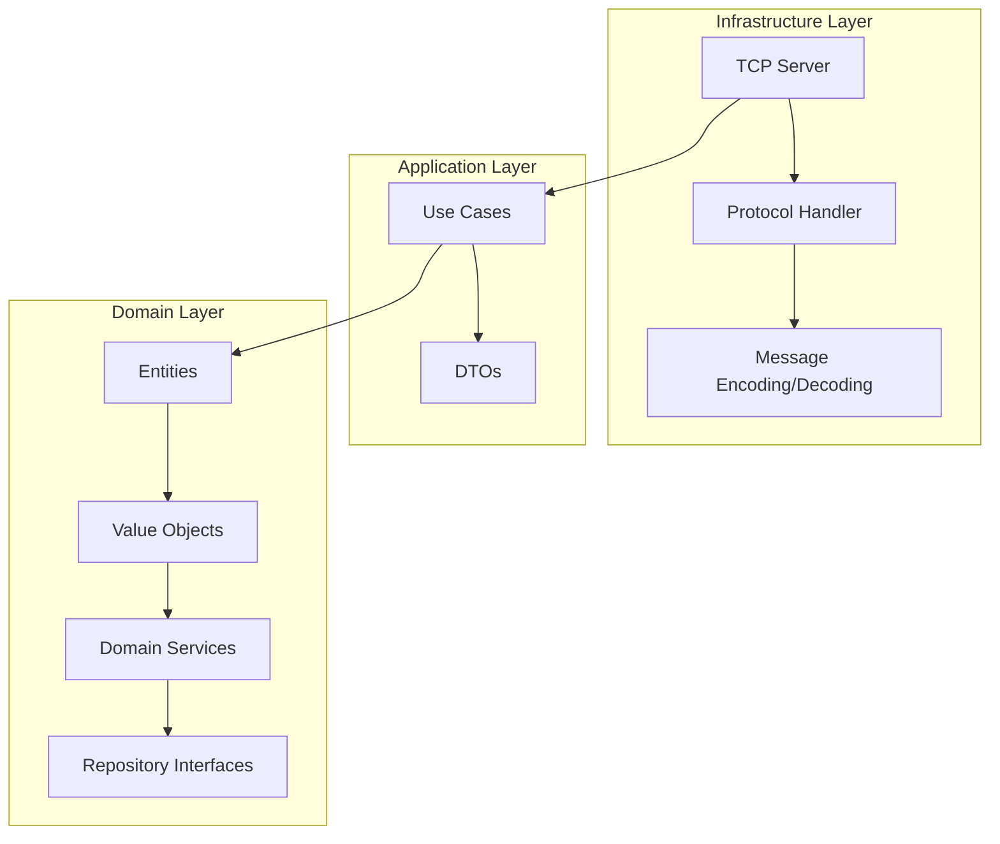

# 🦀 Kafka-RS: Educational Kafka Implementation in Rust

[](https://github.com/elsonwu/kafka-rs/actions)
[](https://opensource.org/licenses/MIT)
[](https://www.rust-lang.org/)

An educational **Apache Kafka-compatible message broker** implementation in Rust, designed for learning how Kafka works under the hood. Built with **Domain-Driven Design (DDD)** principles to demonstrate clean architecture patterns in systems programming.

## 🎯 Purpose

This project serves as an educational resource for understanding:

- **How Apache Kafka works internally** - wire protocol, message storage, consumer groups
- **Domain-Driven Design in systems programming** - clean architecture with Rust
- **Async networking with Tokio** - building high-performance network services
- **Protocol implementation** - parsing and encoding binary protocols
- **Message queue patterns** - producer/consumer, offset management, partitioning

> ⚠️ **Educational Use Only**: This implementation prioritizes learning and clarity over production performance. It uses in-memory storage and simplified algorithms.

## ✨ Features

### 🔌 Kafka Protocol Compatibility
- **Producer API** - Send messages to topics with automatic topic creation
- **Consumer API** - Fetch messages from topics with offset management  
- **Metadata API** - Discover topics, partitions, and broker information
- **Offset Management** - Consumer offset commit and fetch operations
- **Wire Protocol** - Compatible with standard Kafka clients (KafkaJS, kafka-python, etc.)

### 🏗️ Domain-Driven Design Architecture
- **Domain Layer** - Pure business logic with entities, value objects, and domain services
- **Application Layer** - Use cases orchestrating domain operations
- **Infrastructure Layer** - I/O concerns, networking, and persistence
- **Repository Pattern** - Clean separation between business logic and data access

### 📚 Educational Focus
- **Extensive Documentation** - Every component explained with purpose and design decisions
- **Clear Code Structure** - Self-documenting code following DDD patterns
- **Comprehensive Logging** - Educational logs throughout request/response cycles
- **Protocol Transparency** - Easy to understand wire protocol implementation

## 🚀 Quick Start

### Prerequisites
- **Rust 1.87.0+** - [Install Rust](https://rustup.rs/)
- **Cargo** - Comes with Rust installation

### Installation & Running

```bash
# Clone the repository
git clone https://github.com/elsonwu/kafka-rs.git
cd kafka-rs

# Run the server (default port 9092)
cargo run --bin kafka-rs

# Or with custom port
cargo run --bin kafka-rs -- --port 9093

# Run tests
cargo test

# Run with logging
RUST_LOG=info cargo run --bin kafka-rs
```

The server will start and listen on `localhost:9092` (or your specified port).

## 🧪 Testing with KafkaJS

```javascript
const { Kafka } = require('kafkajs');

const kafka = new Kafka({
  clientId: 'test-app',
  brokers: ['localhost:9092']
});

const producer = kafka.producer();
const consumer = kafka.consumer({ groupId: 'test-group' });

async function example() {
  // Connect
  await producer.connect();
  await consumer.connect();
  
  // Produce messages
  await producer.send({
    topic: 'test-topic',
    messages: [
      { key: 'key1', value: 'Hello Kafka-RS!' },
      { key: 'key2', value: 'Educational implementation' }
    ]
  });
  
  // Consume messages
  await consumer.subscribe({ topic: 'test-topic' });
  await consumer.run({
    eachMessage: async ({ partition, message }) => {
      console.log({
        partition,
        offset: message.offset,
        key: message.key?.toString(),
        value: message.value?.toString()
      });
    }
  });
}

example().catch(console.error);
```

## 📖 Documentation

Comprehensive documentation is available in the [`docs/`](docs/) folder:

### Core Documentation
- **[Architecture Overview](docs/architecture.md)** - DDD layers and system design
- **[Getting Started Guide](docs/getting-started.md)** - Installation, usage, and examples  
- **[Domain Model](docs/domain-model.md)** - Core business concepts and rules
- **[API Reference](docs/api-reference.md)** - Kafka protocol endpoints and usage
- **[Wire Protocol](docs/protocol.md)** - Binary protocol implementation details
- **[Client Examples](docs/examples.md)** - Usage with various Kafka clients

### Deep Dive Documentation
- **[Kafka Internals Deep Dive](docs/kafka-internals.md)** - Detailed insights into how Kafka works, protocol formats, RecordBatch vs legacy formats, consumer group coordination, and real-world implementation challenges discovered through building this system
- **[Client Behavior Guide](docs/client-behavior.md)** - Complete producer and consumer workflows, KafkaJS behavior patterns, error handling, configuration best practices, and debugging strategies based on real client interactions

These deep dive documents capture the intricate details of Kafka's operation that you can only discover by implementing a compatible system from scratch.

## 🏗️ Architecture



### Domain Layer (`src/domain/`)
- **Entities** - Core business objects (Topic, Message, Partition)
- **Value Objects** - Immutable types (TopicName, MessageId, Offset)
- **Domain Services** - Business logic (MessageService, OffsetManagementService)
- **Repository Traits** - Data access contracts
- **Domain Events** - Cross-boundary communication
- **Domain Errors** - Business rule violations

### Application Layer (`src/application/`)
- **Use Cases** - Orchestrate domain operations
- **DTOs** - Data transfer objects for boundaries

### Infrastructure Layer (`src/infrastructure/`)
- **TCP Server** - Async connection handling with Tokio
- **Protocol Implementation** - Kafka wire protocol parsing
- **In-Memory Repositories** - Educational persistence implementation

## 🧪 Testing

```bash
# Run all Rust tests
cargo test

# Run specific test suite
cargo test --test integration_tests

# Run with output
cargo test -- --nocapture

# Run benchmarks (if available)
cargo bench
```

### Kafka Client Integration Test

This project includes a comprehensive integration test using real Kafka JavaScript clients to verify protocol compatibility:

```bash
# Prerequisites: Node.js 18+ required
cd integration/kafka-client-test
npm install

# Start the Kafka server (in another terminal)
cargo run --release -- --port 9092

# Run the integration test
npm test
```

The integration test:
- ✅ **Producer Test** - Sends messages using KafkaJS client
- ✅ **Consumer Test** - Receives and verifies message integrity
- ✅ **Metadata Test** - Fetches topic information
- ✅ **CI Integration** - Automatically runs in GitHub Actions

### Test Coverage
- **Unit Tests** - Domain and application logic
- **Integration Tests** - End-to-end server functionality  
- **Protocol Tests** - Wire protocol compatibility
- **Client Compatibility Tests** - Real Kafka client integration with KafkaJS
- **CI/CD Tests** - Automated testing pipeline with multiple Rust versions

## 🛠️ Development

### Quick Development Commands

We provide a `Makefile` with common development tasks:

```bash
# Show all available commands
make help

# Format code (fixes formatting issues automatically)
make format

# Check formatting without making changes  
make check

# Run linting with clippy
make lint

# Run all tests
make test

# Build the project
make build

# Build in release mode
make build-release

# Start the Kafka server
make server

# Fix formatting and linting issues
make fix

# Run integration tests with real Kafka clients
make integration-test

# Run pre-commit checks (format + lint + test)
make pre-commit

# Run CI checks locally
make ci
```

### Development Workflow

1. **Before making changes:**

   ```bash
   make ci  # Ensure everything is working
   ```

2. **After making changes:**

   ```bash
   make fix      # Auto-fix formatting and linting
   make test     # Run tests
   make ci       # Final check before commit
   ```

3. **Before committing:**

   ```bash
   make pre-commit  # Comprehensive pre-commit checks
   ```

### Formatting Configuration

The project uses `rustfmt.toml` for consistent code formatting. The CI will automatically check formatting and provide helpful error messages if issues are found.

### Project Structure

```text
kafka-rs/
├── src/
│   ├── domain/          # Business logic layer
│   ├── application/     # Use case orchestration
│   ├── infrastructure/  # I/O and external systems
│   ├── lib.rs          # Library interface
│   └── main.rs         # Binary entry point
├── docs/               # Comprehensive documentation
├── tests/              # Rust integration tests
├── integration/        # External client integration tests
│   └── kafka-client-test/  # KafkaJS compatibility tests
└── .github/workflows/  # CI/CD pipeline
```

### Contributing

This is an educational project, but contributions are welcome:

1. Fork the repository
2. Create a feature branch with descriptive name (e.g., `feat/consumer-groups`)
3. Make your changes with tests and documentation
4. Use conventional commits (e.g., `feat:`, `fix:`, `chore:`, `docs:`)
5. Run `make pre-commit` to ensure code quality
6. Submit a pull request with conventional commit title

**Conventional Commit Examples:**

- `feat: add consumer group coordination`
- `fix: resolve metadata response parsing issue`  
- `chore: update CI workflow configuration`
- `docs: improve getting started guide`

### Design Principles

- **Educational First** - Clarity over performance
- **Clean Architecture** - Separation of concerns
- **Domain-Driven Design** - Business logic isolation  
- **Protocol Compliance** - Real Kafka client compatibility
- **Comprehensive Testing** - Unit, integration, and compatibility tests

## 📋 Supported Kafka APIs

| API | Key | Status | Description |
|-----|-----|--------|-------------|
| Produce | 0 | ✅ | Send messages to topics |
| Fetch | 1 | ✅ | Consume messages from topics |
| Metadata | 3 | ✅ | Discover topics and brokers |
| OffsetCommit | 8 | ✅ | Commit consumer offsets |
| OffsetFetch | 9 | ✅ | Fetch committed offsets |

### Limitations (Educational Simplifications)

- **In-Memory Storage** - Messages lost on restart
- **Single Partition** - One partition per topic
- **No Replication** - Single broker setup
- **Simplified Consumer Groups** - Basic offset management
- **No Authentication** - Open access for learning

## 📊 Performance

While not optimized for production use, the implementation can handle:

- **~10K messages/sec** for educational workloads
- **Multiple concurrent clients** thanks to Tokio async runtime
- **Low memory footprint** with efficient Rust implementation

## 🔍 Monitoring & Debugging

```bash
# Enable debug logging
RUST_LOG=debug cargo run --bin kafka-rs

# Enable trace logging (verbose)
RUST_LOG=trace cargo run --bin kafka-rs

# JSON structured logging
RUST_LOG=info cargo run --bin kafka-rs 2>&1 | jq
```

## 🤝 Community & Learning

This project is part of learning Rust systems programming and distributed systems concepts:

- **Blog Posts** - Coming soon with implementation details
- **Video Tutorials** - Planned walkthrough of the codebase
- **Conference Talks** - Presenting at Rust meetups

## 📜 License

This project is licensed under the MIT License - see the [LICENSE](LICENSE) file for details.

## 🙏 Acknowledgments

- **Apache Kafka** - For the excellent message broker design
- **Rust Community** - For the amazing ecosystem and resources
- **Domain-Driven Design** - Eric Evans for the architectural patterns
- **Tokio** - For the outstanding async runtime

---

**⭐ Star this repo if you find it useful for learning Kafka internals or Rust systems programming!**

## 📚 Learning Resources

- [Apache Kafka Documentation](https://kafka.apache.org/documentation/)
- [Rust Async Book](https://rust-lang.github.io/async-book/)
- [Domain-Driven Design Book](https://domainlanguage.com/ddd/)
- [Tokio Tutorial](https://tokio.rs/tokio/tutorial)

Built with ❤️ and 🦀 for educational purposes.
