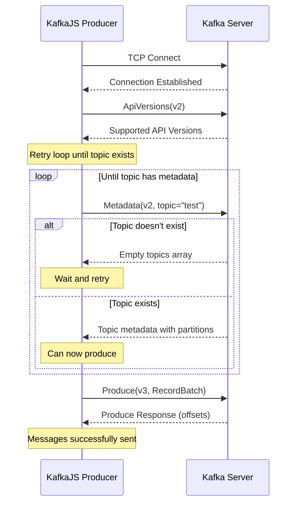
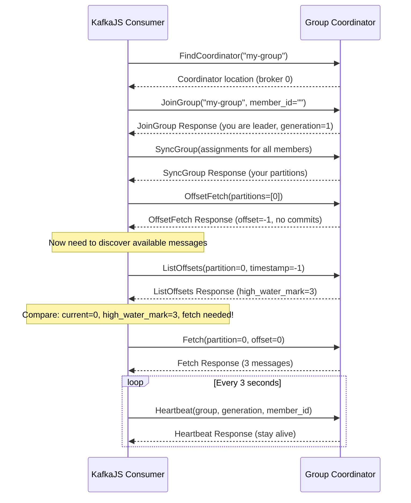

# Kafka Client Behavior: A Practical Guide

This document captures the real-world behavior patterns of Kafka clients that we discovered through implementation and debugging. Understanding these patterns is crucial for building compatible Kafka systems.

## Producer Workflow Deep Dive

### Complete Producer Sequence

Based on our observations with KafkaJS, here's the exact sequence a producer follows:



### Topic Auto-Creation Logic

**Key Discovery**: Topics are created on the **first metadata request**, not on produce requests.

```rust
// This is what happens inside the metadata handler
async fn handle_metadata_request(&mut self, topics: Vec<String>) -> Result<MetadataResponse> {
    for topic_name in topics {
        if !self.topic_exists(&topic_name).await? {
            // Topic creation happens here!
            self.create_topic_with_defaults(&topic_name).await?;
            log::info!("Auto-created topic: {}", topic_name);
        }
    }
    
    // Return metadata for all requested topics (now they exist)
    self.build_metadata_response(topics).await
}
```

**Producer Retry Pattern**:

```javascript
// What KafkaJS does internally:
async function sendMessages() {
    let retryCount = 0;
    const maxRetries = 5;
    
    while (retryCount < maxRetries) {
        try {
            // Always requests metadata first
            const metadata = await this.cluster.refreshMetadata([topicName]);
            
            if (metadata.topics.length === 0) {
                // Topic doesn't exist yet, wait and retry
                await sleep(100 * Math.pow(2, retryCount)); // Exponential backoff
                retryCount++;
                continue;
            }
            
            // Topic exists, now we can produce
            return await this.sendBatch(messages);
            
        } catch (error) {
            if (error.message.includes('topic without metadata')) {
                retryCount++;
                continue;
            }
            throw error; // Other errors are fatal
        }
    }
    
    throw new Error('Failed to create topic after retries');
}
```

### RecordBatch Structure

Modern producers (KafkaJS 2.x+) only send RecordBatch format:

```rust
struct ProduceRequest {
    transactional_id: Option<String>,    // null for non-transactional
    acks: i16,                           // Usually 1 (wait for leader)
    timeout_ms: i32,                     // Request timeout
    topic_data: Vec<TopicProduceData>,
}

struct TopicProduceData {
    topic: String,
    partition_data: Vec<PartitionProduceData>,
}

struct PartitionProduceData {
    partition: i32,                      // Usually 0 for single partition
    record_set: RecordBatch,             // The actual messages
}

// RecordBatch contains multiple records with delta encoding
struct RecordBatch {
    base_offset: i64,                    // First record's offset
    batch_length: i32,                   // Size of everything after this field
    partition_leader_epoch: i32,         // -1 in simple implementations
    magic: u8,                           // Always 2 for RecordBatch
    crc: u32,                            // CRC32 of attributes through records
    attributes: i16,                     // Compression and flags
    last_offset_delta: i32,              // Last record's offset - base_offset
    first_timestamp: i64,                // Timestamp of first record
    max_timestamp: i64,                  // Latest timestamp in batch
    producer_id: i64,                    // -1 for non-idempotent
    producer_epoch: i16,                 // -1 for non-idempotent  
    base_sequence: i32,                  // -1 for non-idempotent
    records_count: i32,                  // Number of records in batch
    records: Vec<Record>,                // Variable-length records
}
```

### Error Handling Patterns

**Connection Errors**:
```javascript
// KafkaJS connection error handling we observed:
{
  "level": "ERROR",
  "logger": "kafkajs", 
  "message": "[Connection] Connection error:",
  "broker": "localhost:9092",
  "stack": "AggregateError [ECONNREFUSED]"
}

// Followed by:
{
  "level": "ERROR", 
  "message": "[BrokerPool] Failed to connect to seed broker, trying another broker from the list",
  "retryCount": 0,
  "retryTime": 96  // Exponential backoff
}
```

**Metadata Errors**:
```javascript
// When topic doesn't have metadata:
{
  "level": "ERROR",
  "message": "[Producer] Failed to send messages: Producing to topic without metadata",
  "retryCount": 0,
  "retryTime": 113
}
```

## Consumer Workflow Deep Dive

### Complete Consumer Sequence

Consumer workflow is much more complex than producer:



### Consumer Group States

**Group Coordinator Selection**:
```rust
// Coordinator is determined by hash of group ID
fn find_coordinator_for_group(group_id: &str) -> BrokerId {
    let hash = hash(group_id.as_bytes());
    let coordinator_id = hash % number_of_brokers;
    BrokerId(coordinator_id)
}

// In single-broker setup, always returns broker 0
```

**Member ID Assignment**:
```rust
// First time joining (empty member_id)
JoinGroupRequest {
    member_id: "",  // Server assigns unique ID
}

JoinGroupResponse {
    member_id: "consumer-my-group-123e4567-e89b-12d3",  // Generated by server
}

// Subsequent requests use assigned ID
HeartbeatRequest {
    member_id: "consumer-my-group-123e4567-e89b-12d3",  // From JoinGroup
}
```

### Partition Assignment Algorithm

**Round-Robin Assignment** (most common):

```rust
fn assign_partitions(members: &[String], partitions: &[TopicPartition]) -> HashMap<String, Vec<TopicPartition>> {
    let mut assignments = HashMap::new();
    
    // Initialize empty assignments
    for member in members {
        assignments.insert(member.clone(), Vec::new());
    }
    
    // Round-robin assignment
    for (i, partition) in partitions.iter().enumerate() {
        let member_index = i % members.len();
        let member = &members[member_index];
        assignments.get_mut(member).unwrap().push(partition.clone());
    }
    
    assignments
}

// Example: 1 member, 1 partition
// member-1: [TopicPartition { topic: "test", partition: 0 }]
```

### Offset Management

**OffsetFetch Response Interpretation**:

```rust
OffsetFetchResponse {
    topics: vec![
        OffsetFetchResponseTopic {
            topic: "test-topic",
            partitions: vec![
                OffsetFetchResponsePartition {
                    partition: 0,
                    offset: -1,        // Special values have meaning
                    metadata: Some(""),
                    error_code: 0,
                }
            ],
        }
    ],
}

// Offset values:
// -1: No committed offset (start from auto.offset.reset setting)
// -2: Start from earliest available offset  
// -3: Start from latest available offset
// >= 0: Start from specific offset
```

**ListOffsets for Message Discovery**:

```rust
// Consumer needs to know if messages are available
ListOffsetsRequest {
    replica_id: -1,  // -1 = consumer request (not replica)
    isolation_level: 0,  // 0 = READ_UNCOMMITTED
    topics: vec![
        ListOffsetsRequestTopic {
            topic: "test-topic",
            partitions: vec![
                ListOffsetsRequestPartition {
                    partition: 0,
                    timestamp: -1,  // -1 = latest offset (high water mark)
                    max_num_offsets: 1,
                }
            ],
        }
    ],
}

ListOffsetsResponse {
    topics: vec![
        ListOffsetsResponseTopic {
            topic: "test-topic", 
            partitions: vec![
                ListOffsetsResponsePartition {
                    partition: 0,
                    error_code: 0,
                    old_style_offsets: None,  // Legacy field
                    timestamp: 1234567890,    // Timestamp of last message
                    offset: 3,                // High water mark (3 messages available)
                }
            ],
        }
    ],
}

// Logic: if current_offset < high_water_mark, fetch messages
// current_offset = 0, high_water_mark = 3 → fetch from offset 0
```

### Fetch Request Processing

**Fetch Request Structure**:

```rust
FetchRequest {
    replica_id: -1,           // -1 = consumer (not replica)
    max_wait_ms: 5000,        // How long to wait for messages
    min_bytes: 1,             // Minimum bytes before returning
    max_bytes: 1024 * 1024,   // Maximum response size
    isolation_level: 0,       // READ_UNCOMMITTED
    session_id: 0,            // Incremental fetch sessions (advanced)
    session_epoch: -1,        // Incremental fetch sessions 
    topics: vec![
        FetchRequestTopic {
            topic: "test-topic",
            partitions: vec![
                FetchRequestPartition {
                    partition: 0,
                    current_leader_epoch: -1,  // Don't check leader epoch
                    fetch_offset: 0,           // Start from offset 0
                    log_start_offset: -1,      // Don't care about log start
                    max_bytes: 1024 * 1024,    // Max bytes for this partition
                }
            ],
        }
    ],
}
```

**Fetch Response with RecordBatch**:

```rust
FetchResponse {
    throttle_time_ms: 0,
    error_code: 0,
    session_id: 0,
    responses: vec![
        FetchResponseTopic {
            topic: "test-topic",
            partitions: vec![
                FetchResponsePartition {
                    partition: 0,
                    error_code: 0,
                    high_watermark: 3,        // Latest available offset
                    last_stable_offset: 3,    // For transactions (same as high_watermark)
                    log_start_offset: 0,      // Earliest available offset
                    aborted_transactions: None, // For transactions
                    preferred_read_replica: None, // Rack awareness
                    records: Some(RecordBatch {
                        // Contains all the messages from offset 0 to 2
                        base_offset: 0,
                        records: vec![
                            Record { offset_delta: 0, /* message 1 */ },
                            Record { offset_delta: 1, /* message 2 */ },
                            Record { offset_delta: 2, /* message 3 */ },
                        ],
                    }),
                }
            ],
        }
    ],
}
```

### Heartbeat and Session Management

**Heartbeat Timing**:

```rust
// Default KafkaJS consumer config
const consumer = kafka.consumer({
    sessionTimeout: 30000,        // 30s - server removes member if no heartbeat
    heartbeatInterval: 3000,      // 3s - how often to send heartbeats
    rebalanceTimeout: 60000,      // 60s - max time for rebalance
});

// Heartbeat loop (simplified)
setInterval(async () => {
    try {
        const response = await sendHeartbeat();
        if (response.error_code === 27) {  // REBALANCE_IN_PROGRESS
            // Stop consuming, rejoin group
            await this.rejoinGroup();
        }
    } catch (error) {
        // Connection lost, reconnect and rejoin
        await this.reconnectAndRejoin();
    }
}, this.heartbeatInterval);
```

**Session Timeout Handling**:

```rust
// Server-side heartbeat tracking
struct GroupMember {
    member_id: String,
    last_heartbeat: Instant,
    session_timeout_ms: u32,
}

// Check for expired members periodically  
async fn check_member_sessions(&mut self) {
    let now = Instant::now();
    let mut expired_members = Vec::new();
    
    for (member_id, member) in &self.group_members {
        let elapsed = now.duration_since(member.last_heartbeat).as_millis() as u32;
        if elapsed > member.session_timeout_ms {
            expired_members.push(member_id.clone());
        }
    }
    
    for member_id in expired_members {
        log::info!("Member {} session expired, removing from group", member_id);
        self.remove_member(&member_id).await?;
        self.trigger_rebalance().await?;
    }
}
```

## Client Configuration Impact

### KafkaJS Configuration for Educational Kafka

**Producer Configuration**:

```javascript
const producer = kafka.producer({
    // Reliability settings
    maxInFlightRequests: 1,           // Simplify ordering (no pipelining)  
    idempotent: false,                // Disable exactly-once (complex)
    transactionTimeout: 30000,        // Not used but good default
    
    // Retry settings  
    retry: {
        initialRetryTime: 100,        // Start with 100ms
        retries: 5,                   // Retry 5 times
        maxRetryTime: 30 * 1000,      // Max 30s between retries  
        factor: 2,                    // Exponential backoff
        multiplier: 2,
        retryDelayOnProduceRateLimit: 100,
    },
    
    // Batching (keep simple)
    batchSize: 16384,                 // 16KB batches
    lingerMs: 10,                     // Wait 10ms for batching
    compression: CompressionTypes.None, // No compression
});
```

**Consumer Configuration**:

```javascript
const consumer = kafka.consumer({
    groupId: 'my-consumer-group',
    
    // Session management
    sessionTimeout: 30000,            // 30s timeout
    rebalanceTimeout: 60000,          // 60s for rebalance
    heartbeatInterval: 3000,          // Heartbeat every 3s
    
    // Offset management
    autoCommit: true,                 // Auto-commit offsets
    autoCommitInterval: 5000,         // Commit every 5s
    autoCommitThreshold: null,        // Commit on every message
    
    // Fetch settings
    maxWaitTimeInMs: 5000,           // Wait up to 5s for messages
    minBytes: 1,                     // Return immediately if any data
    maxBytes: 1024 * 1024,           // 1MB max fetch
    maxBytesPerPartition: 1024 * 1024, // 1MB per partition
    
    // Offset reset
    fromBeginning: false,            // Start from committed offset or latest
});
```

### Common Configuration Mistakes

**Producer Issues**:

```javascript
// ❌ Bad configuration for educational Kafka
const badProducer = kafka.producer({
    idempotent: true,                // Requires complex transaction protocol
    maxInFlightRequests: 5,          // Can cause ordering issues 
    transactionTimeout: 60000,       // Transaction not implemented
    compression: CompressionTypes.gzip, // Compression not implemented
});

// ✅ Good configuration  
const goodProducer = kafka.producer({
    idempotent: false,               // Keep it simple
    maxInFlightRequests: 1,          // Maintain order
    compression: CompressionTypes.None, // No compression
});
```

**Consumer Issues**:

```javascript
// ❌ Bad configuration
const badConsumer = kafka.consumer({
    sessionTimeout: 1000,            // Too short, causes frequent rebalances
    heartbeatInterval: 500,          // Too frequent
    maxWaitTimeInMs: 0,              // Always returns immediately
    minBytes: 1024 * 1024,           // Waits for 1MB before returning
});

// ✅ Good configuration
const goodConsumer = kafka.consumer({
    sessionTimeout: 30000,           // Reasonable timeout
    heartbeatInterval: 3000,         // Not too frequent
    maxWaitTimeInMs: 5000,           // Wait reasonably for data
    minBytes: 1,                     // Return with any data
});
```

## Debugging Client Issues

### Network-Level Debugging

**Enable KafkaJS Debug Logging**:

```javascript
const kafka = new Kafka({
    clientId: 'debug-client',
    brokers: ['localhost:9092'],
    logLevel: logLevel.DEBUG,        // Shows all protocol interactions
});

// Example debug output:
/*
[Connection] Connecting broker: localhost:9092
[Connection] Request ApiVersions(key: 18, version: 2) 
[Connection] Response ApiVersions - size: 80
[Connection] Request Metadata(key: 3, version: 2)
[Connection] Response Metadata - size: 51 
[Producer] Sending batch to partition test-topic-0
[Connection] Request Produce(key: 0, version: 3)
[Connection] Response Produce - size: 87
*/
```

**Protocol-Level Debugging**:

```rust
// Server-side protocol debugging
debug!("→ Received request: {} bytes", raw_message.len());
debug!("  API Key: {} ({})", header.api_key as u16, api_key_name(header.api_key));
debug!("  Version: {}", header.api_version);
debug!("  Correlation ID: {}", header.correlation_id);
debug!("  Client ID: {:?}", header.client_id);

// Process request...

debug!("← Sending response: {} bytes", response_buffer.len());
debug!("  Correlation ID: {}", header.correlation_id);
debug!("  Response type: {}", response_type_name());

// Hex dump for deep debugging
if log::log_enabled!(log::Level::Trace) {
    let hex_dump = response_buffer
        .iter()
        .map(|b| format!("{:02x}", b))
        .collect::<Vec<_>>()
        .join(" ");
    trace!("  Hex: {}", hex_dump);
}
```

### Common Error Patterns

**"Connection Error"**:
```
Cause: Server not running or not listening on correct port
Solution: Check server startup and port configuration
```

**"Topic without metadata"**:
```
Cause: Topic auto-creation not working in metadata handler  
Solution: Ensure topic creation happens on first metadata request
```

**"Buffer bounds error"**:
```
Cause: Incorrect message length calculation or protocol version mismatch
Solution: Double-check message length prefixes and API version support
```

**"Unknown API key"**:
```
Cause: Client using API not implemented by server
Solution: Check ApiVersions response matches what you actually implement
```

This practical guide captures the real-world behavior patterns that are essential for building Kafka-compatible systems. The insights from debugging actual client interactions provide a much deeper understanding than theoretical protocol documentation alone.
